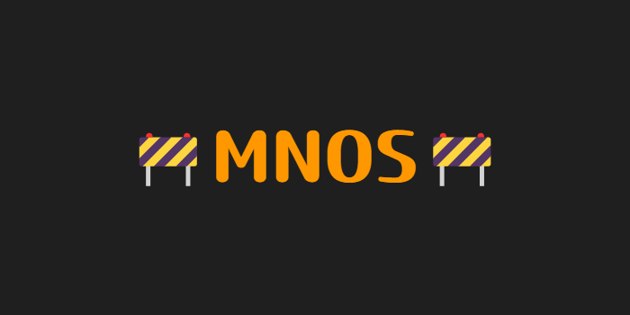

## :construction: In Progress! :construction:

<div align="center">


[](https://angular.io) [](https://opensource.org/license/mit)
[](#contributing)

</div>

<p align="center"><i>A free alternative to organize your projects into visual boards.</i></p>

<div align="center">
  
  
  
</div>

## Introduction
Built in `Angular` with [jsplumb](https://jsplumbtoolkit.com/community) MNOS is a free and open-source alternative to note organization apps like:
- Milanote;
- Evernote;
- Notion.

The idea it's to be a completely free web app, since all these options offer a freemium aproach. 

The main reason to choose Angular it's because the app works directly with HTML canvas element and a lot of functions needs to be built from scratch. So Angular integrated tests and typescript will help to maintain the app and prevent frequent crash in code.

Even if you don't know too much about Angular you can help by proposing some template changes and javascript functions. If you want, you can also watch a crash course tutorial to see how the framework works. You'll see how some features are similar to React and Vue, for example.

I'm also a beginner in Angular. If you have any suggestion to improve the code, don't hesitate to message me!

<br>

## Development
If you want to contribute, see the [contributing](#contributing) section. Your help will be very important to build the project!
<details><summary>Pre-requisites</summary>
<br>
To be able to start development on MNOS, make sure you have the following prerequisites installed:
<ul>
<br>
<li><a href>Node (18.20 or higher)</a></li>
<li><a href>NPM (10 or higher)</a></li>
<li><a href>Angular CLI (17 or higher)</a></li>
</ul>
</details>

1. Clone the repository and install dependencies:
```
git clone https://github.com/gustavofdasilva/mnos.git
cd mnos
npm install
```
<br>

2. Run `ng serve` for a dev server. Navigate to `http://localhost:4200/`. The application will automatically reload if you change any of the source files.
```
ng serve
```
The development environment should now be set up.
<br>

### Build
Run `ng build` to build the project. The build artifacts will be stored in the `dist/` directory.

### Running unit tests
Run `ng test` to execute the unit tests via [Karma](https://karma-runner.github.io/latest/index.html).

### Running end-to-end tests
Run `ng e2e` to execute the end-to-end tests via a platform of your choice. To use this command, you need to first add a package that implements end-to-end testing capabilities.

<br>

## Contributing
:construction: *Since the project it's in a very early stage, probably some features won't be added for now.* :construction: 

MNOS is an open-source project. I really apreciate any effort on it. You can help by: 
- Finding bugs; 
- Proposing new features;
- Improving the docs; 
- Improving the general design
- Many more!

:star: All contributors will have their profiles added to the official website. For now, the best thing you can do to help is star the project and keep up with the changes. 

<br>

## License
MNOS is licensed under the [MIT License](https://opensource.org/license/mit). See the LICENSE file for more information.
