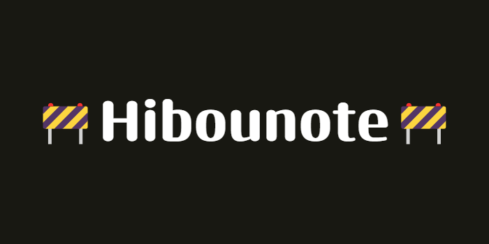

## Open test available!

<div align="center">


[](https://angular.io) [](https://opensource.org/license/mit)
[](#contributing)

</div>

<p align="center"><i>A free alternative to organize your projects into visual boards.</i></p>

<div align="center">
  
  
  
</div>

## 🦉Introduction
<p align="justify"> 
Completely free and without any limitations, Hibounote is a Open Source project that offers a visual and infinite canvas where you can create and manage as many boards as your creativity demands. Whether you're brainstorming, planning projects, or jotting down notes, Hibounote provides an unrestricted, seamless environment to help you turn your thoughts into structured plans.  
</p>

Built in `Angular` with [jsplumb](https://jsplumbtoolkit.com/community) and [Panzoom](https://github.com/timmywil/panzoom/tree/main) Hibounote is a free and open-source alternative to note organization apps like:
- Milanote;
- Evernote;
- Notion;
- Miro.

The idea it's to be a completely free web app, since all these options offer a freemium aproach. 

 

<br>

## 👨‍💻Development
If you want to contribute, see the [contributing](./contributing.md) section. Your help will be very important to build the project!
<details><summary>Pre-requisites</summary>
<br>
To be able to start development on Hibounote, make sure you have the following prerequisites installed:
<ul>
<br>
<li><a href="https://nodejs.org/en">Node (v18.20 or higher)</a></li>
<li><a href="https://www.npmjs.com">NPM (v10 or higher)</a></li>
<li><a href="https://angular.dev">Angular (v18)</a></li>
</ul>
</details>

1. Clone the repository and install dependencies:
```
git clone https://github.com/gustavofdasilva/hibounote.git
cd hibounote
npm install
```
<br>

2. Run `ng serve` for a dev server. Navigate to `http://localhost:4200/`. The application will automatically reload if you change any of the source files.
```
ng serve
```
The development environment should now be set up.
<br>

### Build
Run `ng build` to build the project. The build artifacts will be stored in the `dist/` directory.

### Running unit tests
Run `ng test` to execute the unit tests via [Karma](https://karma-runner.github.io/latest/index.html).

### Running end-to-end tests
Run `ng e2e` to execute the end-to-end tests via a platform of your choice. To use this command, you need to first add a package that implements end-to-end testing capabilities.

<br>

## 💡Contributing
Hibounote is an open-source project. I really apreciate any effort on it. You can help by: 
- Finding bugs; 
- Proposing new features;
- Improving the docs; 
- Improving the general design
- Many more!

Find the contributing guide [here](./contributing.md)

:star: All contributors will have their profiles added to the official website.

<br>

## 💬Stay in touch
- [X (twitter)](https://x.com/hibounote)
- [Instagram](https://www.instagram.com/hibounote)
- [Roadmap and Goals](https://github.com/hibounoteapp/hibounote/discussions/19)

<br>

## 🎨Assets used

### Logo

[OpenMoji](https://openmoji.org/library/emoji-1F989/#variant=black). License: [CC BY-SA 4.0](https://creativecommons.org/licenses/by-sa/4.0/#)

### Icons

- [Feather Icons](https://feathericons.com)
- [Ionicons](https://ionic.io/ionicons)
- [FontAwesome](https://fontawesome.com)

### Background images

- [Haikei](https://app.haikei.app)

<br>

## 📃License
Hibounote is licensed under the [MIT License](https://opensource.org/license/mit). See the LICENSE file for more information.
